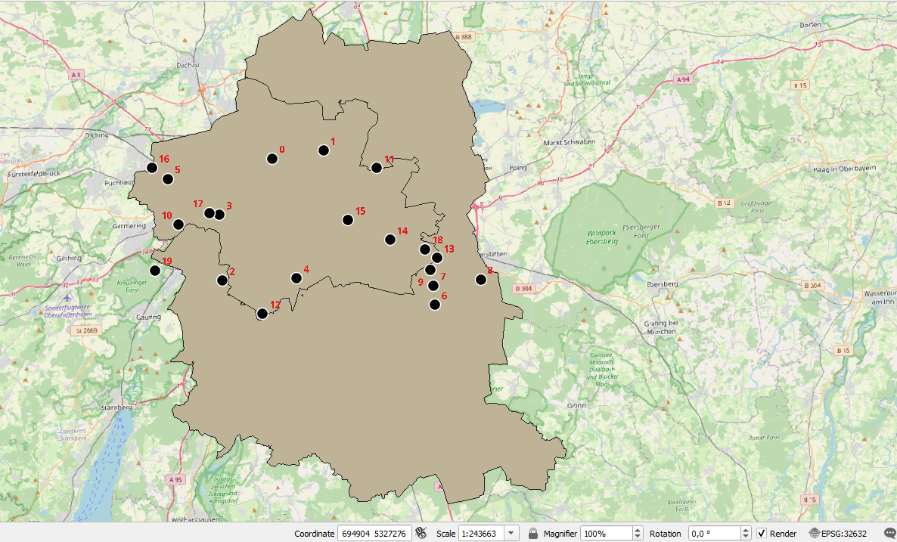
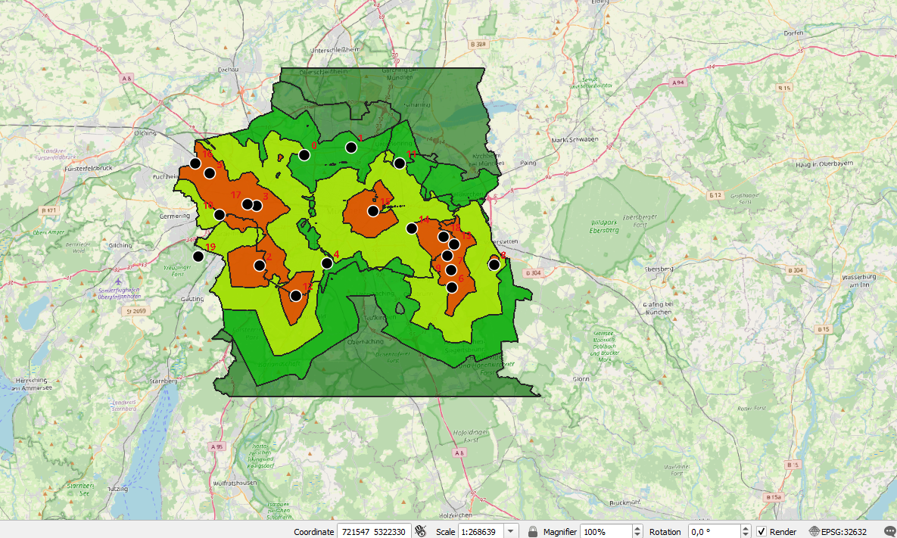
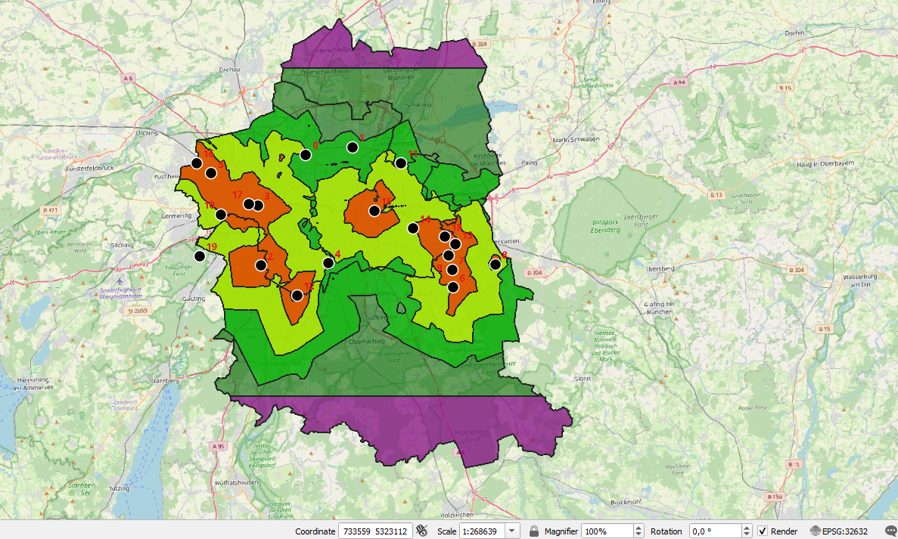
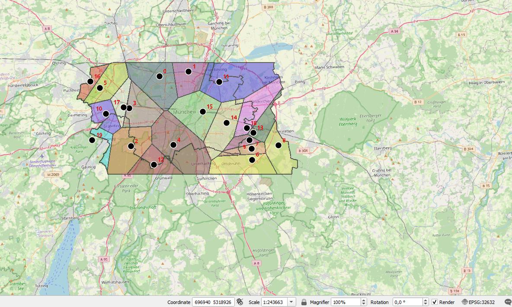

# Last-Mile Delivery Coverage Gap Analysis — Munich


A PyQGIS script demonstrating delivery coverage gap analysis using 
simulated hub locations and OpenStreetMap road network data for Munich.

---

## What This Project Does

Takes a set of delivery hubs and a city road network, then calculates:
- How much of the city each hub can realistically reach by road
- Which areas fall outside all hub coverage zones
- Which hub is responsible for which part of the city

---

## Screenshots
### Delivery Hubs


20 randomly generated delivery hubs placed across Munich city boundary.
Munich Boundary is Marked in 🟤

### Coverage Zones


🔴 0 — 3333m from nearest hub  
🟡 3333 — 6666m from nearest hub  
🟢 6666 — 10000m from nearest hub  
🟣 Beyond 10000m — no hub coverage  

### Coverage Gaps



🔵 Blue = areas completely outside all hub reach within 10km.
North and south Munich are underserved — no hub can reach these 
neighborhoods within 10km by road.


### Hub Territories


Each zone shows the area closest to one specific hub. Assigned Random Colours. 

---

## Methodology

**Isochrone Analysis (QNEAT3)**
- Road network: OSM roads (motorway, trunk, primary, secondary, 
  tertiary, unclassified)
- Max distance: 10,000m
- Contour interval: 3,333m (3 bands)
- Cell size: 50m
- Strategy: Shortest path by distance
- Default speed: 30 km/h

**Voronoi Territories**
- Buffer region: 10% of layer extent
- Clipped to official Munich city boundary (admin_level=6)

**Coverage Gap Detection**
- Munich city boundary minus dissolved isochrone polygons
- Reveals areas unreachable by any hub within 10km

---

## Note on Data

Hub locations are randomly generated for demonstration purposes.
Road network is from OpenStreetMap via BBBike.org.
City boundary is from OpenStreetMap (admin_level=6, München).

In a real deployment, hub locations would be replaced with 
actual facility coordinates.

---

## Project Structure
```
├── Scripts/
│   └── logistics_coverage_analysis.py
├── Screenshots/
│   ├── Coverage_Analysis_Isochrones.png
│   ├── Coverage_Gaps.png
│   ├── Random_Delivery_Hubs_in_Munich.png
│   └── Voronoi_Territories.png
└── README.md
```

---

## Tools Used

| Tool | Purpose |
|---|---|
| QGIS 3.28 | GIS platform |
| PyQGIS | Script automation |
| QNEAT3 | Network-based isochrone analysis |
| OpenStreetMap | Road network and boundary data |
| Python 3.10 | Scripting language |

---

## Skills Demonstrated

- PyQGIS scripting and processing framework
- Network analysis using QNEAT3
- Isochrone generation from road network
- Voronoi tessellation and spatial clipping
- Automated layer styling via PyQGIS renderer API
- Geoprocessing chain (intersection, difference, fix geometries)

---

## Author

Salwin M S | GIS Analyst | TUM graduate | Kerala, India
